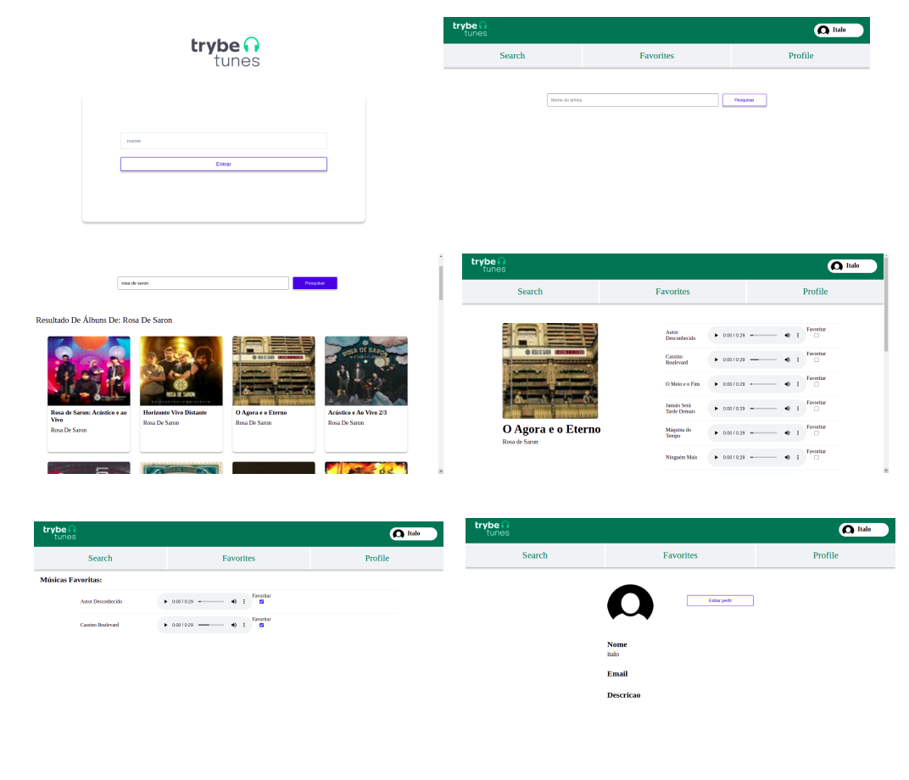

<h1 align="center">
     <a href="#" alt="site de despesa"> Trybe Tunes </a>
</h1>

<h3 align="center">
    Seu sistema de músicas preferido, pesquise bandas e escute em qualquer lugar do mundo.
</h3>

<h4 align="center">
	🚧   Concluído 🚀 🚧
</h4>

Tabela de conteúdos
=================
<!--ts-->
   * [Sobre o projeto](#-sobre-o-projeto)
   * [Funcionalidades](#-funcionalidades)
   * [Layout](#-layout)
   * [Tecnologias](#-tecnologias)

<!--te-->

## 💻 Sobre o projeto

Trybe Tunes - O projeto tem como objetivo criar um sistema de músicas inspirado em aplicações como spotify.

---

## ⚙️ Funcionalidades

- [x] Cliente pode pesquisar cantor.
- [x] Escolher qualquer album já publicado do cantor selecionado.
- [x] Tocar um preview das músicas. 
- [x] Criar uma playlist com suas músicas favoritas.
- [x] Personalizar seu próprio perfil na plataforma.

---

## 🎨 Layout

  

## 🛠 Tecnologias

As seguintes ferramentas foram usadas na construção do projeto:

-   **React Router Dom**
-   **React**
-   **Requisições assíncronas**
-   **Figma**

